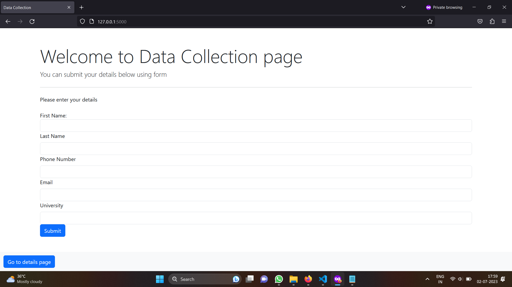
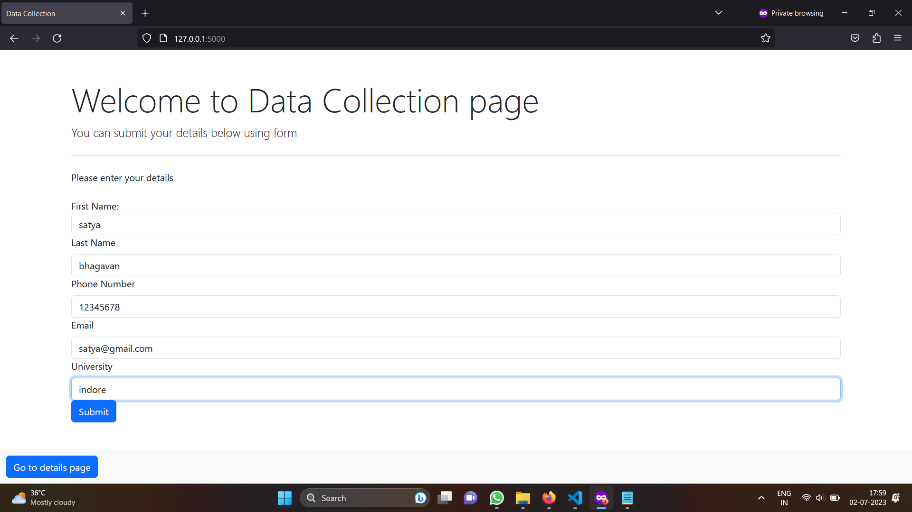
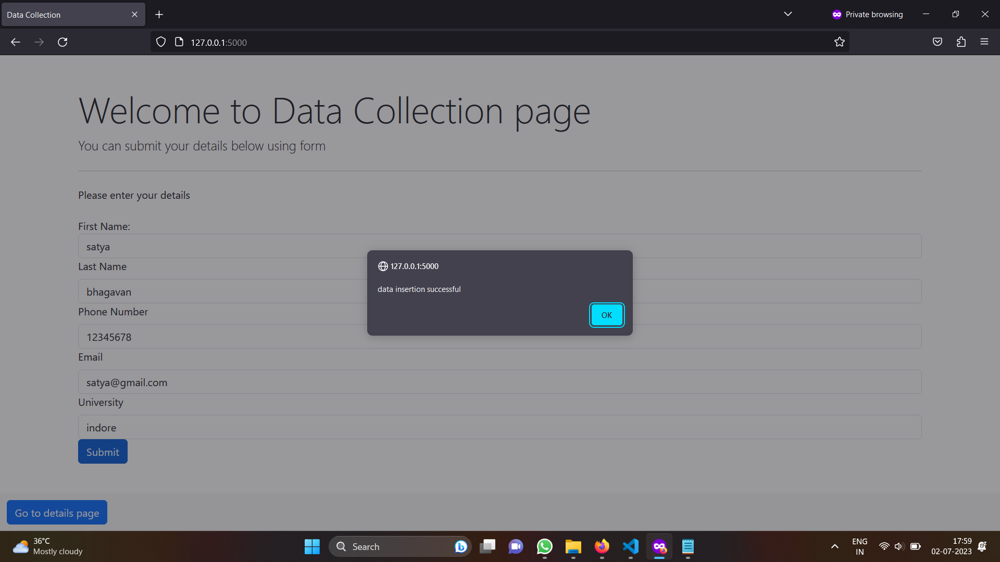
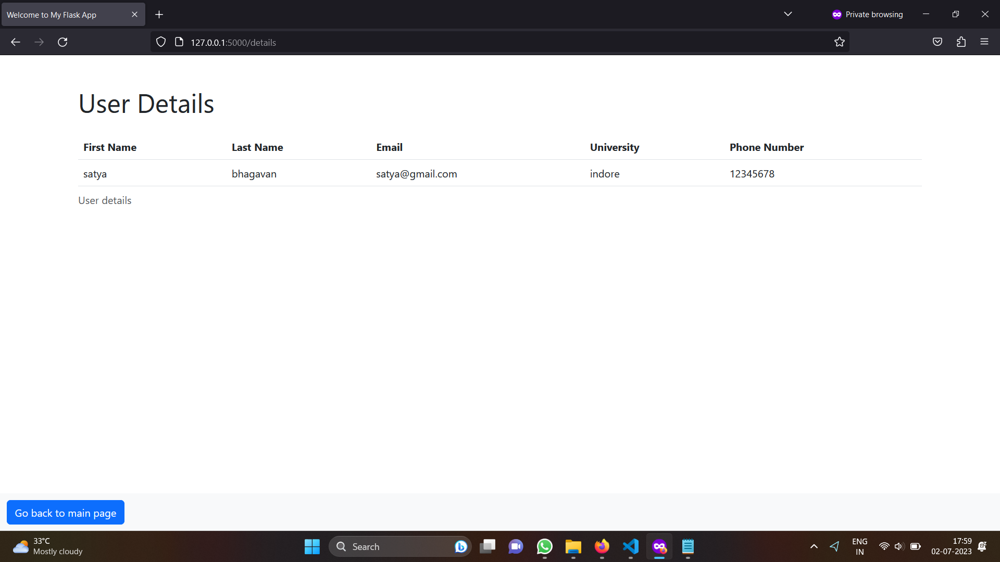

# Simple flask app

## what's implemented

- created a flask application where we can add the details
- we can view the details
- used templates to directly serve the frontend

## end points of the backend

## -- baseurl/

it is the home page it serves the template where we can see the form for filling out the details

## -- baseurl/submit

it is a POST request which is going to take the input fields and add the details to the backend

## -- baseurl/details

it is a get request where we serving a web page with the details of the all the information in the database

## -- baseurl/data

it is a get request where we serving the respons of json with the data in it ( same as the /details but here we get json data not a webpage)

## how to run the app

- install the flask, Flask-PyMongo and pymongo
- connect to the database past the mongodb uri in the app
- once pasted run the app by
  ```
      python app.py
  ```
- then we can access the application
- if want to load with dummy data run the script file to see the application more clearly

## screenshots





